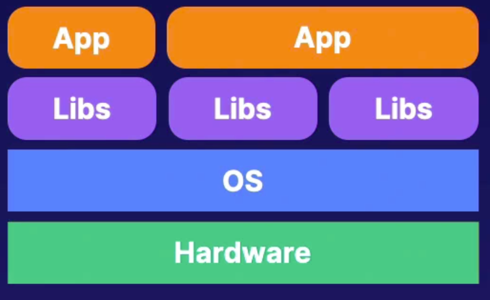
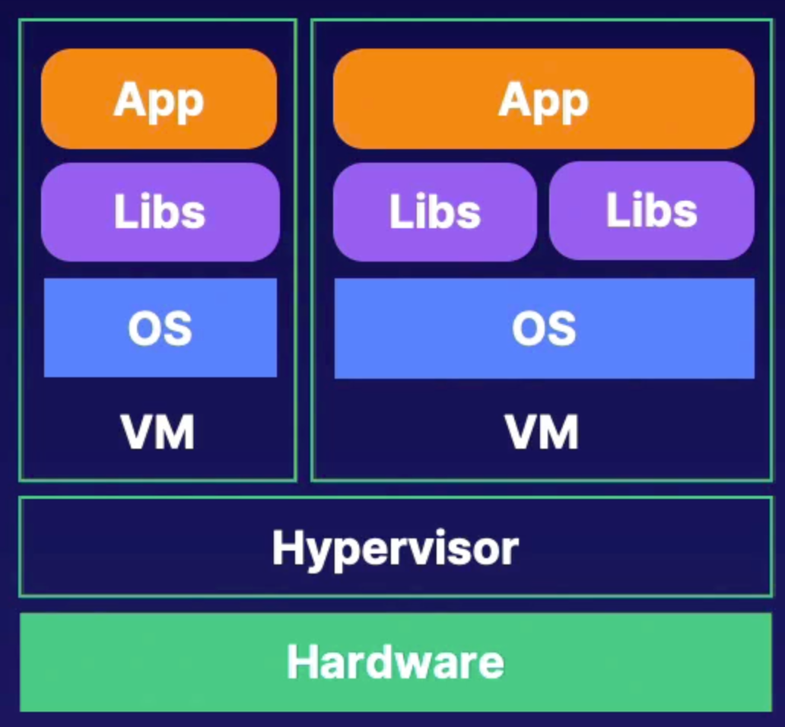
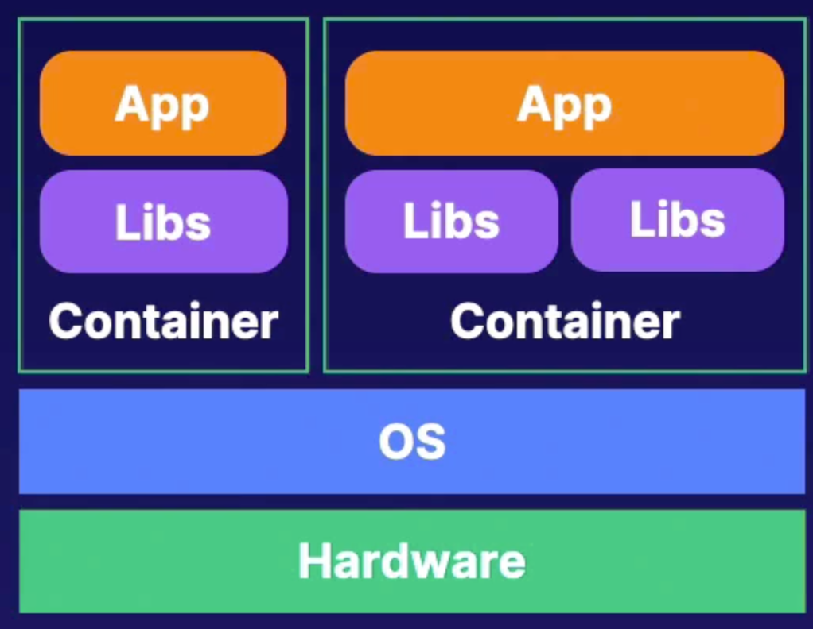

# Docker notes

## Containers are isolated execution environments.  
(otherwise known as BSD Jails, Zones or Virtual Private Server)

 

## Containers versus other approaches?

<table>
<tr>
<td style="vertical-align: top;">

## Bare Metal

No Virtualization - The application or service is deployed directly onto the machine. The old way of doing things with the physical machine (single PC)used to develop and deploy the applications during development.
</td>
<td style="vertical-align: top;">

## Virtual Machines

The hardware is virtualized so multiple operating systems can be isolated on the same machine. It maintains its own VM with Kernel and OS, it does not use underlying operating systems resources.
</td>
<td style="vertical-align: top;">

## Containers

Virtualized operating system libraries and applications are isolated within their own namespace. Small, simple, consistent, compact and isolated containers using underlying Operating systems resources.
</td>
</tr>
</table>

## Benefits of Containers  
   

> `QUICK` : Few resources needed to be installed due to resources being shared with the host Operating System.  

> `CONSISTENT` : All needed libraries and application requirements are packaged with the container, called container image. images can be used on different machines with the same configuration. 

> `SIMPLE` : Deploy using base images. Copy, share and reuse environments after configuration

## Resources

### CheatSheets
https://dockerlabs.collabnix.com/docker/cheatsheet/